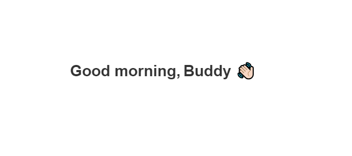

# Time based Greeting

This simple web application displays a greeting message based on the current time of the day. It dynamically changes the greeting message (Good morning, Good afternoon, or Good evening) and appends a waving hand emoji to a designated element.

#### How it Works

The JavaScript code in `Time-based-Greeting.js` retrieves the current hour of the day, determines the appropriate greeting message, and updates the text content of the greeting element accordingly. It also appends a waving hand emoji to the tag element.

## Technologies Used

- HTML
- CSS
- JavaScript

## How to Run

### Option 1: Download ZIP

1. Download the ZIP file from the [GitHub repository](https://github.com/0xelsherif/Time-based-Greeting).
2. Extract the ZIP file to your desired location.
3. Open the extracted folder.
4. Double-click the `index.html` file to open it in a web browser.

### Option 2: Clone the Repository

1. Clone the repository using the following command in your terminal or command prompt:
``` 
git clone https://github.com/0xelsherif/Time-based-Greeting.git 
```
2. Navigate to the cloned directory:
``` 
cd Time-based-Greeting
```
3. Open the `index.html` file in a web browser.

## Preview



## Support and Contributions

If you find this project useful or interesting, consider giving it a star ⭐ on GitHub and spreading the word! Your support means a lot to me and helps in maintaining and improving the project.

If you'd like to contribute to the project, whether it's fixing bugs, adding new features, or improving documentation, feel free to open a pull request. Contributions of all kinds are welcome!

## Follow Me

Follow me on GitHub to stay updated with my latest projects and contributions:

[](https://github.com/0xelsherif)

### Buy Me a Coffee ☕

If you'd like to support the development of this project further or express your appreciation with a small gesture, consider buying me a coffee! Your support helps keep me fueled for more coding sessions. Thank you for your support! 

[](https://www.buymeacoffee.com/0xelsherif)
